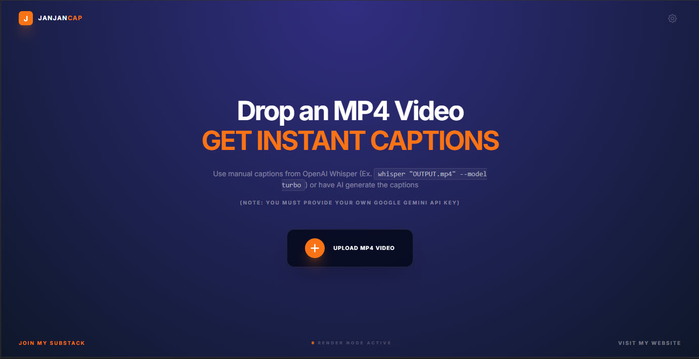
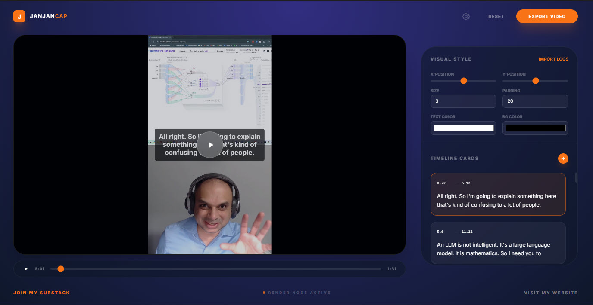
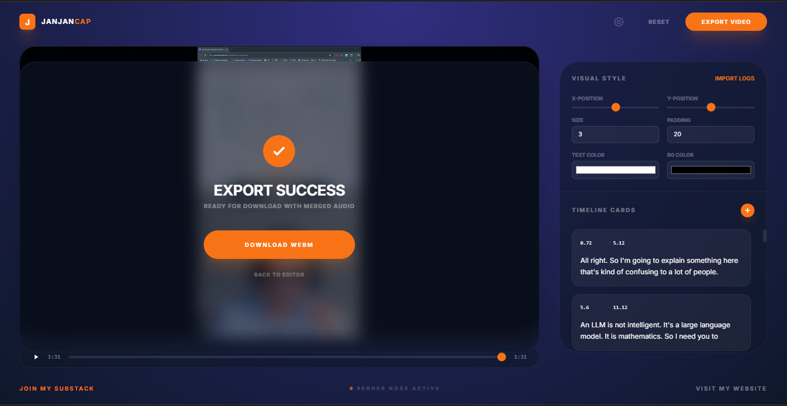

# JanJanCap - An OFFLINE / VPS MP4 Video Caption Generation App

**JanJanCap** is an open-source, minimalist, local-first utility for simple Caption overlays. Designed for content creators building tutorials or shorts.

How did I come up with the name? It was January 2026 and well it was a caption tool and hence JanJanCap HAHAHAHA ;) 

**NOTE:** This was a Vibe Coded project using Google Gemini and ChatGPT for Prompting by **Solomon Christ** and updates are the responsibility of community contributors.

---

## 📸 Demo & Screenshots

## Vision
To provide a private, easy to use caption generation tool for video content.

## Feature List
- **Local-First Recording**: Everything stays in your browser. No cloud uploads (Except if you are using the AI functionality to generate AI Transcriptions)
- **Easy UI**: Change Caption position, color, text and more!
- 
## Tech Stack
- **React 18** (TypeScript)
- **Tailwind CSS**

## Quick Start
NOTE: You need to have node.js installed on your system, download and then do an npm install for this app.

Then run using "npm run dev" and open in localhost and follow the instructions:

1. Open the application in a modern desktop browser (Chrome/Edge/Brave).
2. Upload MP4 File and Choose your Caption Data Type (I would recommend using Whisper offline and then take that data (whisper "OUTPUT.mp4" --model turbo) and copy/paste it in)
3. Edit the transcription in the video and then generate the final video render
NOTE: Do NOT change the screen while it is Rendering or else the render will come out bad (Frozen video while audio is working fine). Keep videos short, videos of 1-5 minutes or less work best. This is NOT a solution for long form videos!!! Also REFRESH the app screen by hitting the refresh button on the webpage for every new video you want to do captions for.

## Offline Whisper Setup

### A) CLI Guide (Windows)
1. Install Python 3.11+. Ensure "Add Python to PATH" is checked.
2. Install FFmpeg (If you want to be able to edit the Webm Videos After): `choco install ffmpeg` or download binaries and add to PATH.
  2a. NOTE: Use the following command to convert a video from webm to mp4 using ffmpeg: `ffmpeg -i "INPUT.webm" -c:v libx264 -preset veryfast -crf 22 -c:a aac -b:a 192k -movflags +faststart "OUTPUT.mp4"`
3. For OFFLINE AI Audio Transcription Install OpenAI Whisper: `pip install -U openai-whisper`
4. Run (After you separate the audio from the file - try it with the mp4, should work): `whisper "OUTPUT.mp4" --model turbo`

## Additional Notes from Eric Knaus (https://www.linkedin.com/in/ericknaus/) Thanks Eric!
Also my install procedure was a bit different but I logged it for you:
* I had to navigate to JanJanCap > JanJanCap-Tool, and run `npm init --yes` to reconstruct the package.json file.
* Then I ran `npm i` to connect the package.json to npm.
* Then I could run `npm run dev`.
* I have something else running on port 3000 so this ran on the next available port above 3000.

## License
MIT License. Copyright (c) 2025 Solomon Christ (www.solomonchrist.com).

---
**Created by Solomon Christ**
[Solomon Christ Website](https://www.solomonchrist.com) | [AI Brief Substack](https://solomonchristai.substack.com/)
